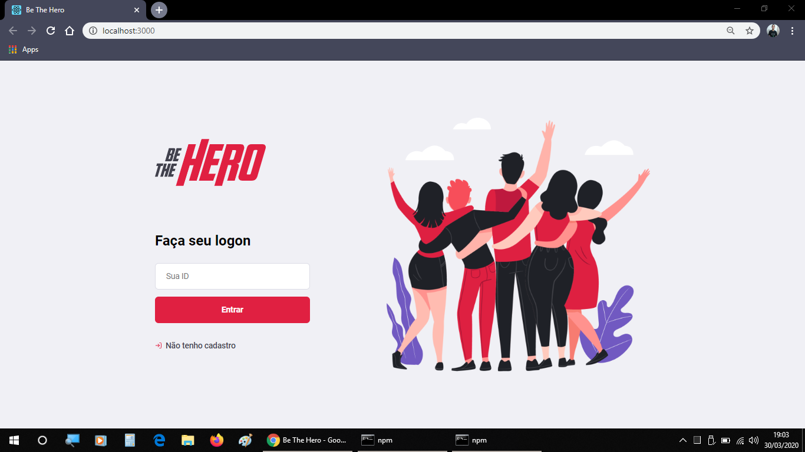
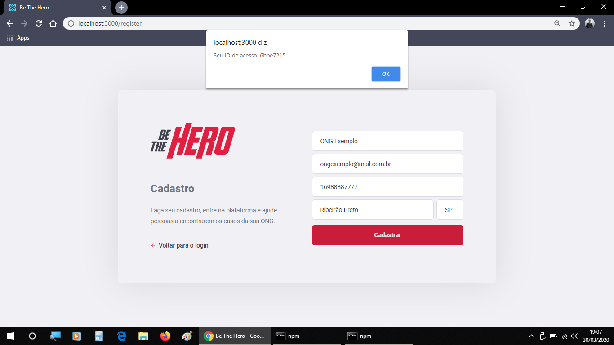
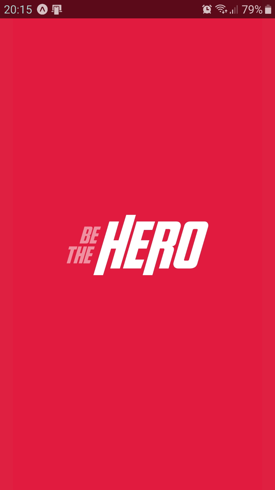
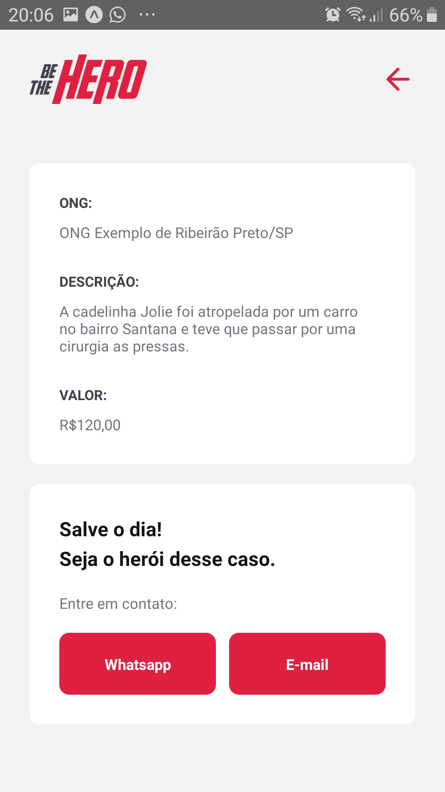

<h1 align="center">
  
</h1>

<h3 align="center">
  Be The Hero - Conecte sua ONG com pessoas que desejam lhe ajudar.
</h3>

  
  
  
  
  
  

  

  <a href="#-about">About</a>&nbsp;&nbsp;&nbsp;|&nbsp;&nbsp;&nbsp;
  <a href="#-preview">Preview</a>&nbsp;&nbsp;&nbsp;|&nbsp;&nbsp;&nbsp;
  <a href="#-technologies">Technologies</a>&nbsp;&nbsp;&nbsp;|&nbsp;&nbsp;&nbsp;
  <a href="#-how-to-use">How to use</a>&nbsp;&nbsp;&nbsp;|&nbsp;&nbsp;&nbsp;
  <a href="#-license">License</a>

## :dart: About

  Projeto desenvolvido durante a décima primeira edição da Semana OmniStack, promovida pela Rocketseat!:rocket:

  Basicamente, o projeto conecta ONGs com pessoas que querem ajudar.

  As ONGs registram os casos / incidentes por meio da web e as pessoas visitam o aplicativo mobile, considerando entrar em contato com a ONG por e-mail ou whatsapp para ajudar, tornando-se o herói deste caso.

## :camera: Preview

&nbsp;
&nbsp;
&nbsp;

&nbsp;
&nbsp;
&nbsp;
&nbsp;

## :computer: Technologies

  

  
Backend

- [Celebrate](https://github.com/arb/celebrate)
- [Cors](https://www.npmjs.com/package/cors)
- [Cross-Env](https://www.npmjs.com/package/cross-env)
- [Express](https://www.npmjs.com/package/express)
- [Jest](https://www.npmjs.com/package/jest)
- [Knex](http://knexjs.org/)
- [Node.js](https://nodejs.org/)
- [sqlite3](https://www.npmjs.com/package/sqlite3)
- [Supertest](https://www.npmjs.com/package/supertest)
- [Jest](https://jestjs.io/)
- [TS-Node](https://www.npmjs.com/package/ts-node)
- [TS-Node-Dev](https://www.npmjs.com/package/ts-node-dev)
- [Typescript](https://www.typescriptlang.org/)

  
Frontend web

- [Axios](https://www.npmjs.com/package/axios)
- [React](https://pt-br.reactjs.org/)
- [React-DOM](https://pt-br.reactjs.org/docs/react-dom.html)
- [React Icons](https://react-icons.netlify.com/#/)
- [React Router Dom](https://reacttraining.com/react-router/web/)
- [Typescript](https://www.typescriptlang.org/)

  
Mobile

- [Axios](https://www.npmjs.com/package/axios)
- [Expo](https://expo.io/learn)
- [Expo Constants](https://docs.expo.io/versions/latest/sdk/constants/)
- [Expo Mail Composer](https://docs.expo.io/versions/latest/sdk/mail-composer/)
- [Intl](https://www.npmjs.com/package/intl)
- [React](https://pt-br.reactjs.org/)
- [React Native](https://reactnative.dev/)
- [React Navigation](https://reactnavigation.org/)
- [Typescript](https://www.typescriptlang.org/)

## :rocket: How to use

First of all you need to have `node` and `npm`(or `yarn`) installed on your machine.
_If you decide to use npm don't forget to delete yarn.lock in folders_

>  Install Node.js v12.x LTS
>  
>  **macOS using [Homebrew](https://brew.sh/):** `brew install node@12`
>  
>  **Windows using [Chocolately](https://chocolatey.org/) and PowerShell:** `choco install nodejs-lts`
>  
>  **Linux distributions:** See Node.js [docs](https://nodejs.org/en/download/package-manager/)

Then you can clone the repository.

`git clone https://github.com/azagatti/be-the-hero`

First start the application backend.

1. `cd backend`
2. `yarn` or `npm install`
3. `yarn start` or `npm start`

Now starting the web application.

1. `cd frontend`
2. `yarn` or `npm install`
3. `yarn start` or `npm start`

Starting the application with Expo.

1. `cd mobile`
2. `yarn` or `npm install`
3. `yarn start` or `npm start`
4. Press on `Run on Android device/emulator` or `Run on iOS simulator`
5. Another option is to install Expo on your phone and scan the QRCode.

## :wrench: How can I contribute?

- Fork this repository;
- Create a branch with your feature: `git checkout -b minha-feature`;
- Commit your changes: `git commit -m 'feat: Minha nova feature :tada:'`;
- Push it to your branch: `git push origin minha-feature`.

After merging your pull request, your branch can be deleted;

## :memo: License

This project is under MIT. See at here [LICENSE](/LICENSE) for more informations.

---

Made by :heart: by [Leonardo do Nascimento](https://github.com/leonardofuba)

