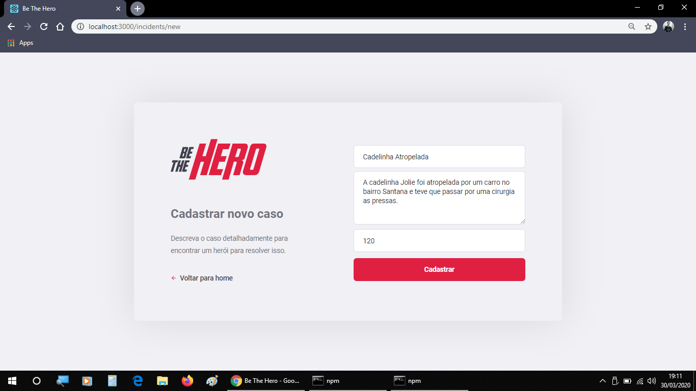
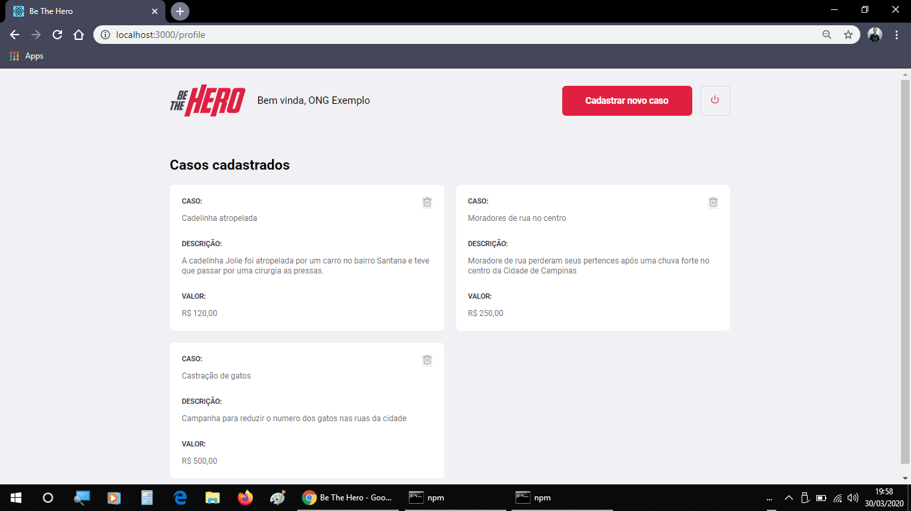
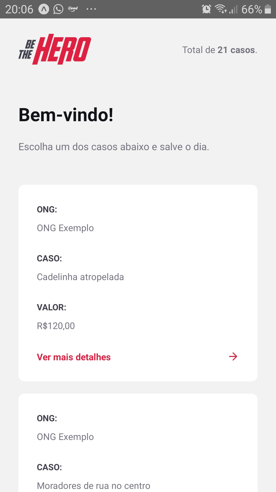
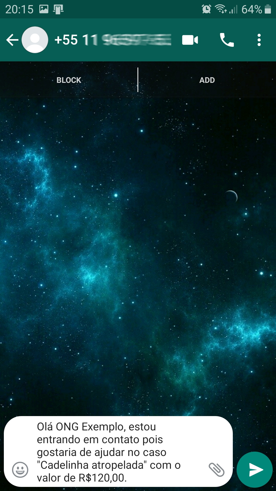

# Be The Hero 


#

Projeto desenvolvido durante a décima primeira edição da Semana OmniStack, promovida pela Rocketseat!:rocket:

## Descrição do projeto

Basicamente, o projeto conecta ONGs com pessoas que querem ajudar.

As ONGs registram os casos / incidentes por meio do front-end e as pessoas visitam o aplicativo mobile, considerando entrar em contato com a ONG por e-mail ou whatsapp para ajudar, tornando-se o herói deste caso.


## Tecnologias usadas
1. Node.js, [Express](https://expressjs.com/) (backend)
2. SQLite, [Knex](http://knexjs.org/) (database)
3. React, [Axios](https://github.com/axios/axios#axios-api) (frontend)
4. [React Native](https://reactnative.dev/docs/getting-started), [Expo](https://expo.io/learn) (mobile)
5. [Celebrate](https://github.com/arb/celebrate)/[Jest](https://jestjs.io/) (validations)
6. [Supertest](https://github.com/visionmedia/supertest) (tests)


## Execução local da aplicação

Instalar Node.js v12.x LTS via gerenciador de pacotes


#### macOS usando [Homebrew](https://brew.sh/):

    brew install node@12


#### Windows usando [Chocolately](https://chocolatey.org/) e PowerShell:

    choco install nodejs-lts

#### Ubuntu based distributions
Para outas distros Linux veja na [documentação](https://nodejs.org/en/download/package-manager/) do Node.js

```sh
curl -sL https://deb.nodesource.com/setup_12.x | sudo -E bash -
sudo apt-get install -y nodejs
```
#
Iniciar cada uma das camadas em terminais separados usando a sequencia de comandos

##### Backend

```sh
npm install
npm start
```

##### Frontend WEB
```sh
npm install
npm start
```

##### Mobile pelo Expo

```sh
npm install -g expo-cli
npm install
npm start
```


* Através de um emulador de smartfone acessar o endereço web gerado pelo `npm start` da camada mobile

ou 

* Atráves de um smartfone com o aplicativo expo para **[Android](https://play.google.com/store/apps/details?id=host.exp.exponent&hl=pt_BR)** ou **[iOS](https://apps.apple.com/br/app/expo-client/id982107779)** instalado ler o QR code gerado pelo `npm start` da camada mobile com o aplicativo expo

---






    
